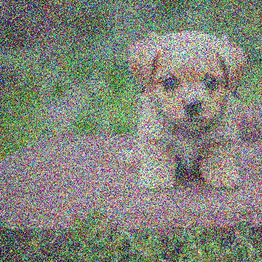
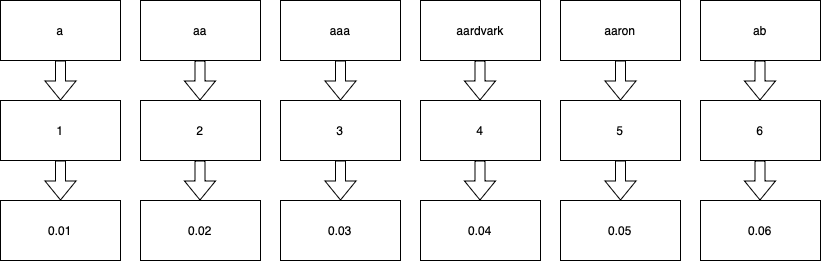

---
---

<video autoplay muted loop src="animations/videos/LLMLogo2.mp4"></video>

---

<pre data-id="title"><code>$(whoami)</code></pre>

# 
Agenda

- Learning from data
- Embeddings
- GPTs or LLMs
- Prompt engineering or RAG
- Fine-tuning
- Examples

# 
Agenda

- Embeddings - Word2Vec
- GPTs or LLMs - llama2.c - llama.cpp - Ollama 
- Prompt engineering or RAG - LlamaIndex
- Fine-tuning or LoRa/QLoRa - MLX - qlora.py

# 
Learning from data

# 
Not learning from data 

# 
<pre data-id="title"><code data-line-numbers>if (value <= threshold1) {
    ...
} else if (value <= threshold2) {
    ...
} else if (value <= threshold3) {
    ...
} ...
...						</code></pre>

#  
<pre data-id="title"><code data-line-numbers>if (value <= threshold1) {
    ...
} else if (value <= threshold2) {
    ...
} else if (value <= threshold3) {
    ...
} else if (value <= threshold4) {
    ...
} else if (value <= threshold5) {
    ...
} ...
...						</code></pre>

# 
<pre data-id="title"><code data-line-numbers>if (value <= threshold1) {
    ...
} else if (value <= threshold2) {
    ...
} else if (value <= threshold3) {
    ...
} else if (value <= threshold4) {
    ...
} else if (value <= threshold5) {
    if (isKnown(value)) {
        ...
    }
    ...
} else if (value <= threshold6) {
    ...
} else if (value <= threshold7) {
    ...
} else if (value <= threshold8) {
    ...
} else if (value <= threshold9) {
    ...
} ...
...						</code></pre>

# 
Learning from data
<video autoplay muted loop src="animations/videos/DecisionTreeSplitScene.mp4"></video>

#  
<video autoplay muted loop src="animations/videos/RandomForestScene.mp4"></video>

# 
<video autoplay muted loop src="animations/videos/PerceptronScene.mp4"></video>

# 
<video autoplay muted loop src="animations/videos/SVMScene.mp4"></video>

# 
<video autoplay muted loop src="animations/videos/NeuralNetworkScene.mp4"></video>

# 
<video autoplay muted loop src="images/rec1.mp4"></video>

# 
<video autoplay muted loop src="images/rec3.mp4"></video>

# 
<video autoplay muted loop src="animations/videos/GANScene.mp4"></video>

# 
<video autoplay muted loop src="animations/videos/VAEScene.mp4"></video>

# 

 
 >  

 >  

 >  

 >  

# 
Compute graphs / model formats

- Pickle (.pickle | .pkl)
- Tensorflow (.ckpt | hdf5 | .pb)
- PyTorch (.pt | .pth)
- Safetensors (.safetensors)
- ONNX (.onnx)

# 
Encodings or Embeddings or Word vectors

# 

# 

a tiny gpt

# 
A bigger GPT

# 
RAG or glorified prompt engineering :)

# 
LoRa & QLoRa 

# 
Ollama

# 
Data

# 
next

# 
q & a

# 
<video autoplay muted loop src="animations/videos/ThankYou.mp4"></video>

